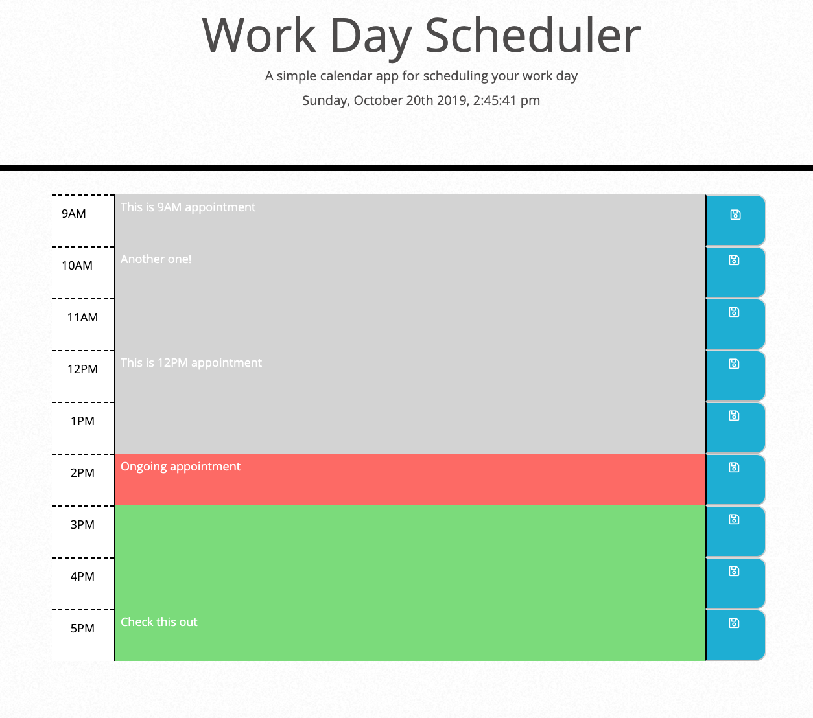

# day-planner
Saving appointments on a work calendar 

# User Story
As an employee with a busy schedule I want tot add important events to a daily planner, so that I can manage my time effectively.

# About The App
A simple calendar application that allows the user to save events for each hour of the day. This app will run in the browser and feature dynamically updated HTML and CSS powered by jQuery.

The app should display standard business hours (9 a.m. to 5 p.m.). Each time slot should represent one hour and contain the following:

* The time

* A field to hold user input

* A save button

Clicking on the save button will store the time and user input in `localStorage`.

Near the top of the calendar, the application displays the current day. Additionally, each hour is color coded to reflect whether the time slot is in the past, the present, or the future. This changes depending on the time of day.

## Business Context

Poor time management can result in missed meetings and deadlines or create the appearance of unprofessionalism. A daily planner allows employees to see their day at a glance, schedule time effectively, and improve productivity. 

© 2019 Sary Jamie. All Rights Reserved.
